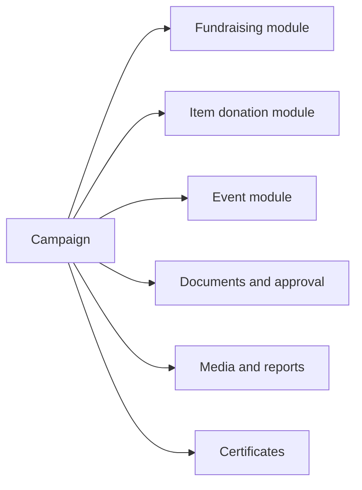
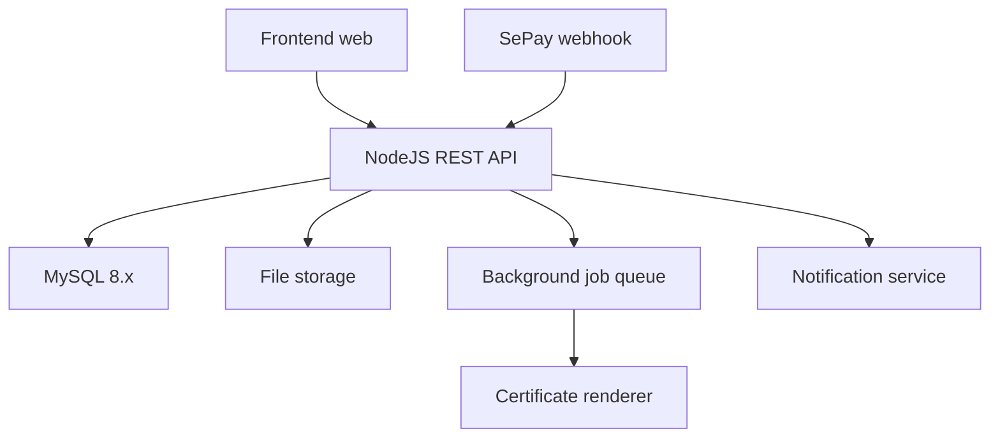

# Tổng quan hệ thống chiến dịch thiện nguyện

## 1. Mục tiêu

Hệ thống hỗ trợ nhà trường, Liên chi đoàn và Câu lạc bộ tổ chức các chiến dịch thiện nguyện theo một mô hình thống nhất. Sinh viên có thể khám phá, đăng ký tham gia, đóng góp tiền, quyên góp hiện vật, theo dõi lịch sử hoạt động và nhận chứng nhận.

Tài liệu này dùng để định hướng triển khai hệ thống với backend NodeJS, REST API JSON và MySQL 8.x.

## 2. Nguồn tham khảo

| Nguồn                                   | Cách sử dụng                                                              |
| --------------------------------------- | ------------------------------------------------------------------------- |
| `mot_so_luu_y_markdown.md`              | Nguồn nghiệp vụ chính: tác nhân, luồng, module, quy tắc vận hành.         |
| `Sinh Viên/*.mhtml`                     | Tham khảo giao diện public và trải nghiệm sinh viên.                      |
| `LCĐ-CLB/*.mhtml`                       | Tham khảo giao diện quản trị tổ chức, gây quỹ, sự kiện, cài đặt, báo cáo. |
| `LCĐ-CLB/Donation Import Template.xlsx` | Tham khảo nhập dữ liệu đóng góp thủ công.                                 |

## 3. Phạm vi hệ thống

### Trong phạm vi

- Trang công khai để xem danh sách và chi tiết chiến dịch.
- Dashboard cá nhân cho sinh viên.
- Workspace quản lý chiến dịch cho LCĐ/CLB.
- Dashboard duyệt và giám sát cho Đoàn trường.
- Quản lý campaign theo mô hình container nhiều module.
- Module gây quỹ hiện kim.
- Module quyên góp hiện vật.
- Module sự kiện ở mức đăng ký, check-in và hoàn thành cơ bản.
- Chứng nhận, render PDF, verify công khai, revoke/reissue.
- Thông báo, audit log, báo cáo tổng hợp.
- Tích hợp SePay realtime để nhận giao dịch tiền.

### Ngoài phạm vi MVP nhưng có điểm mở rộng

- Tự động đối soát và tự động duyệt giao dịch SePay.
- Ký số chứng nhận bằng hạ tầng CA chính thức.
- Mobile app native.
- Thanh toán online trực tiếp trong hệ thống.

## 4. Mô hình campaign container

`Campaign` là thực thể trung tâm. Mỗi campaign có thông tin tổng và chứa nhiều module hành động.

Campaign tạo trước, module thêm sau. Đơn vị tổ chức có thể preview trang công khai trước khi gửi duyệt. Đoàn trường duyệt ở cấp campaign và có thể bình luận theo campaign, module hoặc tài liệu.

## 5. Tác nhân

| Tác nhân        | Mô tả                      | Năng lực chính                                                                |
| --------------- | -------------------------- | ----------------------------------------------------------------------------- |
| Khách công khai | Người chưa đăng nhập.      | Xem chiến dịch công khai, xem hồ sơ tổ chức, verify chứng nhận.               |
| Sinh viên       | Người dùng cuối trung tâm. | Đăng ký tham gia, đóng góp tiền, đăng ký hiện vật, xem lịch sử và chứng nhận. |
| LCĐ/CLB         | Đơn vị tổ chức chiến dịch. | Tạo campaign, thêm module, vận hành hàng chờ, xuất báo cáo, cấp chứng nhận.   |
| Đoàn trường     | Quản trị cấp trường.       | Duyệt campaign, quản lý đơn vị, giám sát dữ liệu, xem báo cáo toàn trường.    |
| Hệ thống nền    | Tác vụ tự động.            | Gửi thông báo, tính progress, render chứng nhận, ghi audit, xử lý webhook.    |

## 6. Module chính

| Module             | Mục tiêu                                                                                   | Đối tượng thao tác chính                          |
| ------------------ | ------------------------------------------------------------------------------------------ | ------------------------------------------------- |
| Gây quỹ hiện kim   | Nhận tiền đóng góp và xác minh giao dịch.                                                  | Sinh viên, LCĐ/CLB, hệ thống SePay.               |
| Quyên góp hiện vật | Ghi nhận nhu cầu vật phẩm, đăng ký đóng góp và xác nhận bàn giao.                          | Sinh viên, LCĐ/CLB.                               |
| Sự kiện            | Đăng ký tham gia hoạt động/sự kiện thuộc campaign, check-in và ghi nhận hoàn thành cơ bản. | Sinh viên, LCĐ/CLB.                               |
| Chứng nhận         | Cấp, lưu, tải và verify chứng nhận.                                                        | Sinh viên, LCĐ/CLB, Đoàn trường, khách công khai. |

## 7. Quy tắc thiết kế quan trọng

- LCĐ mặc định có thành viên là tất cả sinh viên thuộc khoa, phân biệt bằng mã số sinh viên.
- Tài khoản vận hành cho Đoàn trường, LCĐ và CLB được cấp sẵn; pilot nhanh chưa có flow thành viên CLB trong hệ thống.
- Gây quỹ hiện kim tích hợp SePay realtime để nhận giao dịch nhưng không tự động duyệt giao dịch.
- Phải bổ sung quyên góp hiện vật vì mẫu tham khảo chưa có tab riêng.
- Trang chính của đơn vị tổ chức tập trung vào chiến dịch gây quỹ, quyên góp hiện vật và sự kiện.
- Chứng nhận đã cấp không được sửa trực tiếp; nếu sai phải revoke và phát hành lại.

## 8. Kiến trúc triển khai gợi ý

Backend có thể dùng Express, NestJS hoặc Fastify. Tài liệu API không phụ thuộc framework, chỉ quy định endpoint, payload, quyền và trạng thái.

## 9. Chuẩn response API toàn hệ thống

Tất cả REST API trong hệ thống dùng một envelope chung:

- Success: `ApiResponseSuccess<T>` với `success=true`, `message`, `data`.
- Error: `ApiResponseError` với `success=false`, `message`, `errors`, optional `stack` chỉ ở môi trường debug/dev.
- API dạng list trả `data.items` và `data.pagination`.
- API dạng detail hoặc action trả object kết quả trực tiếp trong `data`.

Map lỗi chuẩn:

- `401 Unauthenticated`: chưa đăng nhập, token sai, token hết hạn.
- `403 Forbidden`: sai quyền, sai organization scope, sai phạm vi khoa.
- `404 Resource not found`: không tìm thấy campaign, module, donation, certificate hoặc tài nguyên khác.
- `409 State conflict`: thao tác sai trạng thái nghiệp vụ, ví dụ submit sai trạng thái, check-in khi chưa approved, verify donation đã xử lý.
- `422 Validation failed`: thiếu field bắt buộc, body/query sai format, thiếu cấu hình bắt buộc trước khi submit.

Mục tiêu của chuẩn này là để tài liệu nghiệp vụ, API, kiểm thử và backlog cùng bám một hợp đồng thống nhất, tránh mỗi nhóm hiểu response theo một kiểu khác nhau.
