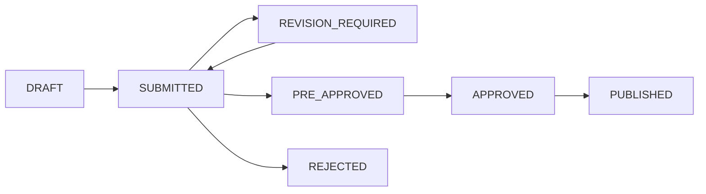

# Nghiệp vụ và luồng xử lý

## 1. Trạng thái tổng quát

| Đối tượng     | Trạng thái chính                                                                                                               |
| ------------- | ------------------------------------------------------------------------------------------------------------------------------ |
| Campaign      | `DRAFT`, `SUBMITTED`, `PRE_APPROVED`, `APPROVED`, `REVISION_REQUIRED`, `REJECTED`, `PUBLISHED`, `ONGOING`, `ENDED`, `ARCHIVED` |
| Module        | `DRAFT`, `READY_FOR_REVIEW`, `APPROVED`, `OPEN`, `CLOSED`, `CANCELLED`                                                         |
| Đăng ký       | `PENDING`, `APPROVED`, `REJECTED`, `CANCELLED`, `CHECKED_IN`, `COMPLETED`                                                      |
| Đóng góp tiền | `PENDING`, `MATCHED`, `VERIFIED`, `REJECTED`, `REFUNDED`                                                                       |
| Hiện vật      | `PLEDGED`, `CONFIRMED`, `RECEIVED`, `REJECTED`, `CANCELLED`                                                                    |
| Chứng nhận    | `PENDING`, `RENDERING`, `READY`, `SIGNED`, `REVOKED`, `FAILED`                                                                 |

**Quy ước API áp dụng cho mọi luồng:**

- Response thành công luôn theo `ApiResponseSuccess<T>` gồm `success=true`, `message`, `data`.
- Response lỗi luôn theo `ApiResponseError` gồm `success=false`, `message`, `errors`, optional `stack` ở môi trường debug/dev.
- Lỗi auth map sang `401 Unauthenticated`.
- Lỗi permission/scope map sang `403 Forbidden`.
- Lỗi sai trạng thái nghiệp vụ map sang `409 State conflict`.
- Lỗi validate input hoặc thiếu điều kiện bắt buộc map sang `422 Validation failed`.

## 2. Luồng khám phá công khai

**Mục tiêu:** khách công khai và sinh viên tìm chiến dịch phù hợp.

1. Người dùng mở trang khám phá.
2. Hệ thống hiển thị campaign `PUBLISHED` hoặc `ONGOING`.
3. Người dùng tìm kiếm, lọc theo loại module, trạng thái, đơn vị tổ chức.
4. Người dùng mở chi tiết campaign.
5. Hệ thống hiển thị mô tả, tiến độ, module đang mở, đơn vị tổ chức, minh bạch và CTA.

**Điều kiện hiển thị:**

- Campaign đã được duyệt và công khai.
- Module chỉ hiện CTA khi trạng thái là `OPEN`.
- Người chưa đăng nhập chỉ được xem; khi thực hiện hành động phải đăng nhập.

## 3. Luồng sinh viên tham gia campaign

1. Sinh viên đăng nhập.
2. Sinh viên mở campaign chi tiết.
3. Sinh viên chọn một hành động:
    - Đóng góp tiền.
    - Đăng ký quyên góp hiện vật.
    - Đăng ký sự kiện.
4. Hệ thống tạo bản ghi theo module.
5. Hệ thống gửi thông báo xác nhận đã ghi nhận.
6. Sinh viên theo dõi trạng thái trong trang cá nhân.

**Lỗi cần xử lý:**

- Campaign hoặc module đã đóng: `409 State conflict`.
- Sinh viên không thuộc phạm vi cho phép: `403 Forbidden`.
- Đăng ký trùng nếu module không cho phép đăng ký nhiều lần: `409 Duplicate resource` hoặc `409 State conflict` theo rule triển khai.
- Số lượng chỗ sự kiện hoặc vật phẩm đã đủ: `409 State conflict`.

## 4. Luồng tạo campaign của LCĐ/CLB

1. Quản trị tổ chức tạo campaign container ở trạng thái `DRAFT`.
2. Nhập thông tin cơ bản: tên, mô tả ngắn, mục tiêu, ảnh đại diện, thời gian, phạm vi, đối tượng thụ hưởng.
3. Thêm một hoặc nhiều module.
4. Upload tài liệu tổng và tài liệu theo module nếu có.
5. Preview trang công khai.
6. Gửi duyệt.

**Rule kiểm tra khi gửi duyệt:**

- Campaign có ít nhất một module.
- Thời gian module nằm trong thời gian campaign.
- Fundraising có mục tiêu tiền và cấu hình tài khoản nhận tiền.
- Item donation có ít nhất một item target.
- Event có quota hoặc cấu hình nhận đăng ký.
- LCĐ không mở campaign ngoài khoa nếu không được cấp quyền.

**Kỳ vọng API khi gửi duyệt:**

- Đủ điều kiện: `success=true`, `message`, `data.status=SUBMITTED`.
- Thiếu module/cấu hình: `422 Validation failed`, `errors.details`.
- Sai quyền tổ chức hoặc sai scope khoa: `403 Forbidden`.
- Campaign không ở trạng thái được submit lại: `409 State conflict`, `errors.current_status`.

## 5. Luồng duyệt campaign của Đoàn trường

1. Đơn vị tổ chức gửi duyệt.
2. Hệ thống kiểm tra logic trước khi đưa vào queue.
3. Đoàn trường xem campaign, module, tài liệu và preview.
4. Đoàn trường bình luận nếu cần chỉnh sửa.
5. Đoàn trường chọn một hành động:
    - Yêu cầu sửa.
    - Sơ duyệt.
    - Duyệt chính thức.
    - Từ chối.
6. Campaign được duyệt có thể công khai.

## 6. Luồng gây quỹ hiện kim

### Đóng góp thủ công

1. Sinh viên mở form đóng góp.
2. Nhập số tiền, thông tin chuyển khoản hoặc upload minh chứng.
3. Hệ thống tạo donation `PENDING`.
4. LCĐ/CLB kiểm tra minh chứng hoặc đối soát danh sách giao dịch.
5. LCĐ/CLB xác minh donation thành `VERIFIED` hoặc từ chối.
6. Hệ thống cập nhật progress campaign.

**Kỳ vọng API:**

- Tạo donation: `success=true`, `data.status=PENDING`, có `payment_instruction`.
- Verify donation: `success=true`, `data.status=VERIFIED`.
- Verify donation đã `VERIFIED/REJECTED`: `409 State conflict`.

### Qua SePay realtime

1. Người đóng góp chuyển khoản theo nội dung định danh.
2. SePay gửi webhook giao dịch về hệ thống.
3. Hệ thống lưu `payment_transaction`.
4. Hệ thống thử match với donation hoặc campaign/module.
5. Giao dịch match được đánh dấu `MATCHED`, chờ người vận hành xác minh.
6. Không tự động chuyển sang `VERIFIED`.

**Kỳ vọng API webhook:**

- Webhook hợp lệ: `success=true`, `message`, `data.transaction_id`, `data.match_status`.
- Payload trùng: idempotent, không tạo duplicate transaction.
- Sai secret/signature: `403 Forbidden`.

## 7. Luồng quyên góp hiện vật

1. LCĐ/CLB tạo module hiện vật và danh sách item target.
2. Sinh viên chọn item, số lượng, thời gian bàn giao dự kiến và ghi chú.
3. Hệ thống tạo pledge `PLEDGED`.
4. LCĐ/CLB xác nhận pledge nếu phù hợp.
5. Khi nhận vật phẩm, LCĐ/CLB ghi nhận số lượng thực nhận, ảnh minh chứng nếu có.
6. Hệ thống cập nhật progress theo từng item target.

**Rule chính:**

- Không cho pledge vượt quá nhu cầu nếu module cấu hình giới hạn cứng.
- Cho phép nhận thiếu hoặc nhận dư có ghi chú.
- Chỉ tính vào báo cáo khi trạng thái là `RECEIVED`.

**Kỳ vọng API:**

- Tạo pledge: `success=true`, `data.status=PLEDGED`.
- Vượt target khi `allow_over_target=false`: `422 Validation failed` hoặc `409 State conflict` theo cách validate chọn trong codebase.
- Handover trước khi confirm: `409 State conflict`.

## 8. Luồng sự kiện

1. LCĐ/CLB tạo module sự kiện: mô tả, địa điểm, quota, thời gian, quyền lợi nếu có.
2. Sinh viên gửi đăng ký tham gia.
3. Hệ thống tạo registration `PENDING` hoặc `APPROVED` theo cấu hình.
4. LCĐ/CLB duyệt hoặc từ chối nếu sự kiện cần xét duyệt.
5. Sinh viên được duyệt có thể check-in.
6. Kết thúc sự kiện, LCĐ/CLB đánh dấu hoàn thành hoặc cập nhật số giờ tham gia.
7. Hệ thống đưa người đủ điều kiện vào danh sách cấp chứng nhận.

**Kỳ vọng API:**

- Tạo registration: `success=true`, `data.status=PENDING` hoặc `APPROVED`.
- Đăng ký trùng: `409 Duplicate resource`.
- Check-in khi chưa `APPROVED`: `409 State conflict`.

## 9. Luồng chứng nhận

1. Rule phase đầu xác định người đủ điều kiện từ event registration `COMPLETED`.
2. Hệ thống tạo certificate `PENDING`.
3. Snapshot dữ liệu được khóa: thông tin sinh viên, campaign, đơn vị tổ chức, vai trò, thời lượng, thành tích.
4. Job render PDF được đưa vào queue.
5. Worker render từ template hiện hành, chèn QR verify và checksum.
6. File được lưu vào storage.
7. Certificate chuyển sang `READY` hoặc `SIGNED`.
8. Sinh viên tải file hoặc mở link verify.

**Revoke/reissue:**

- Không sửa certificate đã phát hành.
- Revoke bản cũ với lý do.
- Tạo bản mới với snapshot mới.
- Audit log ghi đủ người thao tác, thời gian và lý do.

**Kỳ vọng API:**

- Generate thành công: `success=true`, `data.created_count`, `data.skipped_count`.
- Verify public certificate revoked vẫn trả `success=true`, `data.valid=false`.
- Revoke/reissue trả object kết quả trong `data`, không sửa snapshot bản cũ.

## 10. Luồng tổng kết và báo cáo

1. LCĐ/CLB kết thúc campaign.
2. Hệ thống tổng hợp đóng góp tiền đã verified, hiện vật đã received, event completed và chứng nhận issued.
3. LCĐ/CLB nhập nội dung tổng kết, upload ảnh minh chứng.
4. Xuất báo cáo theo campaign.
5. Đoàn trường xem báo cáo theo thời gian, đơn vị, loại campaign và mức độ tham gia.
