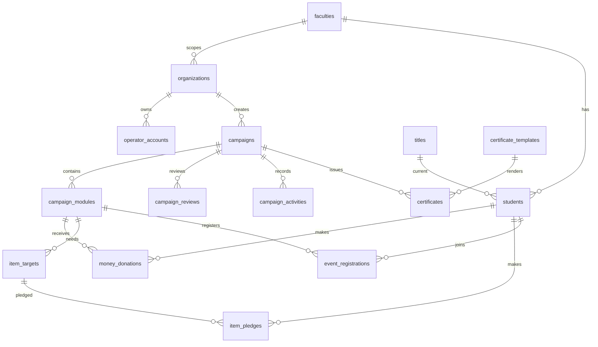

# Thiết kế database MySQL

## 1. Quy ước

- Mục tiêu của schema này là `pilot nhanh`, ưu tiên đủ dùng và dễ triển khai hơn là tách bảng quá chi tiết.
- MySQL 8.x, charset `utf8mb4`, collation `utf8mb4_unicode_ci`.
- Khóa chính dùng `BIGINT UNSIGNED AUTO_INCREMENT`.
- Tiền dùng `DECIMAL(15,2)`.
- Trạng thái dùng `VARCHAR(40)` để service layer kiểm theo state machine.
- JSON dùng cho cấu hình module, snapshot chứng nhận, activity data và payload background job.
- Sinh viên và tài khoản vận hành tách riêng thành 2 bảng:
    - `students`: sinh viên
    - `operator_accounts`: Đoàn trường, LCĐ, CLB
- CLB membership, join request, volunteer module riêng, report snapshot và import batch để phase sau.

## 2. Tổng số bảng

Schema rút gọn dùng `21 bảng`:

1. `faculties`
2. `organizations`
3. `operator_accounts`
4. `students`
5. `refresh_tokens`
6. `oauth_accounts`
7. `campaigns`
8. `campaign_modules`
9. `campaign_reviews`
10. `campaign_activities`
11. `money_donations`
12. `payment_transactions`
13. `item_targets`
14. `item_pledges`
15. `event_registrations`
16. `titles`
17. `certificate_templates`
18. `certificates`
19. `notifications`
20. `audit_logs`
21. `background_jobs`

## 3. Nhóm danh mục và tài khoản

| Bảng                | Cột chính                                                                                                                                                                                                                                | Ghi chú                                                                                 |
| ------------------- | ---------------------------------------------------------------------------------------------------------------------------------------------------------------------------------------------------------------------------------------- | --------------------------------------------------------------------------------------- |
| `faculties`         | `id`, `code`, `name`, `created_at`, `updated_at`                                                                                                                                                                                         | Danh mục khoa.                                                                          |
| `organizations`     | `id`, `code`, `name`, `type`, `faculty_id`, `logo_url`, `description`, `status`, `created_at`, `updated_at`, `deleted_at`                                                                                                                | `type`: `SCHOOL_UNION`, `FACULTY_UNION`, `CLUB`. CLB có thể thuộc khoa hoặc cấp trường. |
| `operator_accounts` | `id`, `organization_id`, `faculty_id`, `email`, `password_hash`, `full_name`, `phone`, `avatar_url`, `role`, `status`, `last_login_at`, `created_at`, `updated_at`, `deleted_at`                                                         | Tài khoản được cấp sẵn cho Đoàn trường, LCĐ, CLB.                                       |
| `students`          | `id`, `faculty_id`, `current_title_id`, `student_code`, `email`, `password_hash`, `full_name`, `class_code`, `major`, `year`, `phone`, `avatar_url`, `status`, `total_points`, `last_login_at`, `created_at`, `updated_at`, `deleted_at` | Sinh viên vừa là hồ sơ vừa là tài khoản đăng nhập.                                      |
| `refresh_tokens`    | `id`, `account_type`, `operator_account_id`, `student_id`, `token_hash`, `expires_at`, `revoked_at`, `created_at`                                                                                                                        | Dùng chung cho cả student và operator. `account_type`: `STUDENT`, `OPERATOR`.           |
| `oauth_accounts`    | `id`, `account_type`, `operator_account_id`, `student_id`, `provider`, `provider_account_id`, `email`, `created_at`                                                                                                                      | Link SSO/tài khoản trường vào đúng identity nội bộ.                                     |

**Rule scope:**

- `operator_accounts.role` quyết định nhóm quyền chính, không dùng bảng role riêng.
- `operator_accounts.organization_id` dùng cho scope CLB/LCĐ/Đoàn trường.
- `operator_accounts.faculty_id` dùng cho role theo khoa nếu cần.
- Sinh viên được xác định phạm vi khoa qua `students.faculty_id`.

## 4. Nhóm campaign

| Bảng                  | Cột chính                                                                                                                                                                                                                                                              | Ghi chú                                                       |
| --------------------- | ---------------------------------------------------------------------------------------------------------------------------------------------------------------------------------------------------------------------------------------------------------------------- | ------------------------------------------------------------- |
| `campaigns`           | `id`, `organization_id`, `title`, `slug`, `summary`, `description`, `cover_image_url`, `beneficiary`, `scope_type`, `faculty_id`, `start_at`, `end_at`, `status`, `published_at`, `created_by`, `approved_by`, `approved_at`, `created_at`, `updated_at`, `deleted_at` | Container trung tâm. `scope_type`: `SCHOOL`, `FACULTY`.       |
| `campaign_modules`    | `id`, `campaign_id`, `type`, `title`, `description`, `start_at`, `end_at`, `status`, `settings_json`, `created_at`, `updated_at`, `deleted_at`                                                                                                                         | Module chính: `fundraising`, `item_donation`, `event`.        |
| `campaign_reviews`    | `id`, `campaign_id`, `module_id`, `author_type`, `author_id`, `body`, `visibility`, `attachment_url`, `created_at`, `updated_at`                                                                                                                                       | Comment duyệt và phản hồi hồ sơ.                              |
| `campaign_activities` | `id`, `campaign_id`, `module_id`, `actor_type`, `actor_id`, `activity_type`, `message`, `data_json`, `created_at`                                                                                                                                                      | Lưu state change, publish, report note, media/file reference. |

**Quy ước `campaign_modules.settings_json`:**

- `fundraising`
    - `target_amount`
    - `currency`
    - `receiver_name`
    - `bank_name`
    - `bank_account_no`
    - `sepay_enabled`
    - `sepay_account_id`
- `item_donation`
    - `receiver_address`
    - `receiver_contact`
    - `allow_over_target`
    - `handover_note`
- `event`
    - `location`
    - `quota`
    - `registration_required`
    - `checkin_required`
    - `benefits`

## 5. Gây quỹ hiện kim

| Bảng                   | Cột chính                                                                                                                                                                                                        | Ghi chú                                                    |
| ---------------------- | ---------------------------------------------------------------------------------------------------------------------------------------------------------------------------------------------------------------- | ---------------------------------------------------------- |
| `money_donations`      | `id`, `campaign_id`, `module_id`, `student_id`, `donor_name`, `amount`, `message`, `evidence_url`, `status`, `matched_transaction_id`, `verified_by`, `verified_at`, `reject_reason`, `created_at`, `updated_at` | Pilot chỉ nhận donation từ user đã xác thực.               |
| `payment_transactions` | `id`, `campaign_id`, `module_id`, `provider`, `provider_transaction_id`, `amount`, `content`, `account_no`, `transaction_time`, `raw_payload`, `match_status`, `matched_donation_id`, `created_at`, `updated_at` | Lưu giao dịch SePay, phục vụ idempotency và manual verify. |

## 6. Quyên góp hiện vật

| Bảng           | Cột chính                                                                                                                                                                                                                                            | Ghi chú                                 |
| -------------- | ---------------------------------------------------------------------------------------------------------------------------------------------------------------------------------------------------------------------------------------------------- | --------------------------------------- |
| `item_targets` | `id`, `campaign_id`, `module_id`, `name`, `unit`, `target_quantity`, `received_quantity`, `description`, `status`, `created_at`, `updated_at`                                                                                                        | Nhu cầu hiện vật.                       |
| `item_pledges` | `id`, `campaign_id`, `module_id`, `item_target_id`, `student_id`, `donor_name`, `quantity`, `expected_handover_at`, `status`, `note`, `received_quantity`, `received_at`, `received_by`, `evidence_url`, `handover_note`, `created_at`, `updated_at` | Gộp luôn thông tin handover vào pledge. |

## 7. Sự kiện

| Bảng                  | Cột chính                                                                                                                                                                                                      | Ghi chú                                                   |
| --------------------- | -------------------------------------------------------------------------------------------------------------------------------------------------------------------------------------------------------------- | --------------------------------------------------------- |
| `event_registrations` | `id`, `campaign_id`, `module_id`, `student_id`, `status`, `answers_json`, `registered_at`, `checked_in_at`, `checked_out_at`, `hours`, `reviewed_by`, `reviewed_at`, `review_note`, `created_at`, `updated_at` | Module event cơ bản, gộp đăng ký + check-in + hoàn thành. |

## 8. Danh hiệu

| Bảng     | Cột chính                                                                         | Ghi chú                |
| -------- | --------------------------------------------------------------------------------- | ---------------------- |
| `titles` | `id`, `name`, `description`, `min_points`, `icon_url`, `created_at`, `updated_at` | Chỉ giữ catalog title. |

**Rule title:**

- `students.total_points` là điểm tích lũy hiện tại.
- `students.current_title_id` là title hiện tại.
- Không có bảng lịch sử unlock ở phase đầu.

## 9. Chứng nhận

| Bảng                    | Cột chính                                                                                                                                                                                                                                               | Ghi chú                                        |
| ----------------------- | ------------------------------------------------------------------------------------------------------------------------------------------------------------------------------------------------------------------------------------------------------- | ---------------------------------------------- |
| `certificate_templates` | `id`, `name`, `type`, `file_url`, `layout_json`, `status`, `created_by`, `created_at`, `updated_at`                                                                                                                                                     | Template tối thiểu cho pilot.                  |
| `certificates`          | `id`, `certificate_no`, `campaign_id`, `module_id`, `student_id`, `template_id`, `status`, `snapshot_json`, `file_url`, `file_hash`, `issued_at`, `revoked_at`, `revoked_by`, `revoke_reason`, `replacement_certificate_id`, `created_at`, `updated_at` | Gộp snapshot, file, revoke info vào cùng bảng. |

**Rule certificate:**

- `snapshot_json` là dữ liệu bất biến để verify.
- Không dùng bảng policy/version/file/revocation riêng trong phase đầu.
- Reissue tạo certificate mới và set `replacement_certificate_id` ở bản cũ hoặc bản liên kết theo hướng implement thống nhất.

## 10. Thông báo, audit và jobs

| Bảng              | Cột chính                                                                                                                                 | Ghi chú                                                           |
| ----------------- | ----------------------------------------------------------------------------------------------------------------------------------------- | ----------------------------------------------------------------- |
| `notifications`   | `id`, `account_type`, `operator_account_id`, `student_id`, `type`, `title`, `body`, `data_json`, `is_email_sent`, `read_at`, `created_at` | In-app notification cho cả student và operator.                   |
| `audit_logs`      | `id`, `actor_type`, `actor_id`, `action`, `entity_type`, `entity_id`, `before_json`, `after_json`, `ip_address`, `created_at`             | Theo dõi approve, verify, revoke, update quyền và cấu hình chính. |
| `background_jobs` | `id`, `type`, `status`, `payload_json`, `attempts`, `last_error`, `run_at`, `locked_at`, `created_at`, `updated_at`                       | Queue DB tối thiểu cho email và render certificate.               |

## 11. Bảng bị loại bỏ

Các bảng sau bị loại khỏi pilot nhanh:

- `users`
- `roles`
- `user_roles`
- `organization_members`
- `club_join_requests`
- `reset_tokens`
- `email_verification_tokens`
- `fundraising_configs`
- `donation_transaction_matches`
- `donation_import_batches`
- `item_donation_configs`
- `item_handover_records`
- `volunteer_configs`
- `volunteer_applications`
- `volunteer_attendance`
- `event_configs`
- `student_titles`
- `certificate_template_versions`
- `certificate_policies`
- `certificate_snapshots`
- `certificate_files`
- `certificate_revocations`
- `report_snapshots`

## 12. Quan hệ chính



## 13. Constraint và index quan trọng

- Unique:
    - `faculties.code`
    - `organizations.code`
    - `operator_accounts.email`
    - `students.student_code`
    - `students.email`
    - `campaigns.slug`
    - `payment_transactions(provider, provider_transaction_id)`
    - `certificates.certificate_no`
- Một `campaign` cấp khoa phải có `faculty_id` khác null.
- `campaign_modules.start_at >= campaigns.start_at` và `campaign_modules.end_at <= campaigns.end_at` kiểm ở service layer.
- `campaign_modules.type` chỉ nhận `fundraising`, `item_donation`, `event`.
- `money_donations.status = VERIFIED` chỉ hợp lệ khi có `verified_by` và `verified_at`.
- `payment_transactions` phải idempotent theo `provider + provider_transaction_id`.
- Chỉ `item_pledges.status = RECEIVED` mới cộng `received_quantity` vào báo cáo.
- Chỉ `event_registrations.status = COMPLETED` mới đủ điều kiện cấp certificate theo rule phase đầu.
- `students.current_title_id` phải match `titles.min_points <= total_points` theo service layer.
- `certificates.status = READY` hoặc `REVOKED` không được sửa `snapshot_json`.

## 14. DDL MySQL tham khảo

```sql
SET FOREIGN_KEY_CHECKS = 0;

DROP TABLE IF EXISTS
  `background_jobs`,
  `audit_logs`,
  `notifications`,
  `certificates`,
  `certificate_templates`,
  `titles`,
  `event_registrations`,
  `item_pledges`,
  `item_targets`,
  `payment_transactions`,
  `money_donations`,
  `campaign_activities`,
  `campaign_reviews`,
  `campaign_modules`,
  `campaigns`,
  `oauth_accounts`,
  `refresh_tokens`,
  `students`,
  `operator_accounts`,
  `organizations`,
  `faculties`;

SET FOREIGN_KEY_CHECKS = 1;

CREATE TABLE `faculties` (
  `id` BIGINT UNSIGNED PRIMARY KEY AUTO_INCREMENT,
  `code` VARCHAR(20) NOT NULL,
  `name` VARCHAR(255) NOT NULL,
  `created_at` DATETIME NOT NULL DEFAULT CURRENT_TIMESTAMP,
  `updated_at` DATETIME NOT NULL DEFAULT CURRENT_TIMESTAMP ON UPDATE CURRENT_TIMESTAMP,
  UNIQUE KEY `uk_faculties_code` (`code`)
) ENGINE=InnoDB DEFAULT CHARSET=utf8mb4 COLLATE=utf8mb4_unicode_ci;

CREATE TABLE `organizations` (
  `id` BIGINT UNSIGNED PRIMARY KEY AUTO_INCREMENT,
  `code` VARCHAR(50) NOT NULL,
  `name` VARCHAR(255) NOT NULL,
  `type` VARCHAR(40) NOT NULL,
  `faculty_id` BIGINT UNSIGNED NULL,
  `logo_url` VARCHAR(500) NULL,
  `description` TEXT NULL,
  `status` VARCHAR(40) NOT NULL DEFAULT 'ACTIVE',
  `created_at` DATETIME NOT NULL DEFAULT CURRENT_TIMESTAMP,
  `updated_at` DATETIME NOT NULL DEFAULT CURRENT_TIMESTAMP ON UPDATE CURRENT_TIMESTAMP,
  `deleted_at` DATETIME NULL,
  UNIQUE KEY `uk_organizations_code` (`code`),
  KEY `idx_organizations_type` (`type`),
  CONSTRAINT `fk_organizations_faculty`
    FOREIGN KEY (`faculty_id`) REFERENCES `faculties` (`id`) ON DELETE SET NULL
) ENGINE=InnoDB DEFAULT CHARSET=utf8mb4 COLLATE=utf8mb4_unicode_ci;

CREATE TABLE `operator_accounts` (
  `id` BIGINT UNSIGNED PRIMARY KEY AUTO_INCREMENT,
  `organization_id` BIGINT UNSIGNED NULL,
  `faculty_id` BIGINT UNSIGNED NULL,
  `email` VARCHAR(255) NOT NULL,
  `password_hash` VARCHAR(255) NOT NULL,
  `full_name` VARCHAR(255) NOT NULL,
  `phone` VARCHAR(30) NULL,
  `avatar_url` VARCHAR(500) NULL,
  `role` VARCHAR(40) NOT NULL,
  `status` VARCHAR(40) NOT NULL DEFAULT 'ACTIVE',
  `last_login_at` DATETIME NULL,
  `created_at` DATETIME NOT NULL DEFAULT CURRENT_TIMESTAMP,
  `updated_at` DATETIME NOT NULL DEFAULT CURRENT_TIMESTAMP ON UPDATE CURRENT_TIMESTAMP,
  `deleted_at` DATETIME NULL,
  UNIQUE KEY `uk_operator_accounts_email` (`email`),
  KEY `idx_operator_accounts_role` (`role`),
  CONSTRAINT `fk_operator_accounts_organization`
    FOREIGN KEY (`organization_id`) REFERENCES `organizations` (`id`) ON DELETE SET NULL,
  CONSTRAINT `fk_operator_accounts_faculty`
    FOREIGN KEY (`faculty_id`) REFERENCES `faculties` (`id`) ON DELETE SET NULL
) ENGINE=InnoDB DEFAULT CHARSET=utf8mb4 COLLATE=utf8mb4_unicode_ci;

CREATE TABLE `titles` (
  `id` BIGINT UNSIGNED PRIMARY KEY AUTO_INCREMENT,
  `name` VARCHAR(120) NOT NULL,
  `description` TEXT NULL,
  `min_points` INT NOT NULL DEFAULT 0,
  `icon_url` VARCHAR(500) NULL,
  `created_at` DATETIME NOT NULL DEFAULT CURRENT_TIMESTAMP,
  `updated_at` DATETIME NOT NULL DEFAULT CURRENT_TIMESTAMP ON UPDATE CURRENT_TIMESTAMP
) ENGINE=InnoDB DEFAULT CHARSET=utf8mb4 COLLATE=utf8mb4_unicode_ci;

CREATE TABLE `students` (
  `id` BIGINT UNSIGNED PRIMARY KEY AUTO_INCREMENT,
  `faculty_id` BIGINT UNSIGNED NOT NULL,
  `current_title_id` BIGINT UNSIGNED NULL,
  `student_code` VARCHAR(30) NOT NULL,
  `email` VARCHAR(255) NOT NULL,
  `password_hash` VARCHAR(255) NOT NULL,
  `full_name` VARCHAR(255) NOT NULL,
  `class_code` VARCHAR(50) NULL,
  `major` VARCHAR(120) NULL,
  `year` SMALLINT UNSIGNED NULL,
  `phone` VARCHAR(30) NULL,
  `avatar_url` VARCHAR(500) NULL,
  `status` VARCHAR(40) NOT NULL DEFAULT 'ACTIVE',
  `total_points` INT NOT NULL DEFAULT 0,
  `last_login_at` DATETIME NULL,
  `created_at` DATETIME NOT NULL DEFAULT CURRENT_TIMESTAMP,
  `updated_at` DATETIME NOT NULL DEFAULT CURRENT_TIMESTAMP ON UPDATE CURRENT_TIMESTAMP,
  `deleted_at` DATETIME NULL,
  UNIQUE KEY `uk_students_student_code` (`student_code`),
  UNIQUE KEY `uk_students_email` (`email`),
  CONSTRAINT `fk_students_faculty`
    FOREIGN KEY (`faculty_id`) REFERENCES `faculties` (`id`) ON DELETE RESTRICT,
  CONSTRAINT `fk_students_current_title`
    FOREIGN KEY (`current_title_id`) REFERENCES `titles` (`id`) ON DELETE SET NULL
) ENGINE=InnoDB DEFAULT CHARSET=utf8mb4 COLLATE=utf8mb4_unicode_ci;

CREATE TABLE `refresh_tokens` (
  `id` BIGINT UNSIGNED PRIMARY KEY AUTO_INCREMENT,
  `account_type` VARCHAR(20) NOT NULL,
  `operator_account_id` BIGINT UNSIGNED NULL,
  `student_id` BIGINT UNSIGNED NULL,
  `token_hash` VARCHAR(255) NOT NULL,
  `expires_at` DATETIME NOT NULL,
  `revoked_at` DATETIME NULL,
  `created_at` DATETIME NOT NULL DEFAULT CURRENT_TIMESTAMP,
  UNIQUE KEY `uk_refresh_tokens_hash` (`token_hash`),
  KEY `idx_refresh_tokens_account_type` (`account_type`),
  CONSTRAINT `fk_refresh_tokens_operator`
    FOREIGN KEY (`operator_account_id`) REFERENCES `operator_accounts` (`id`) ON DELETE CASCADE,
  CONSTRAINT `fk_refresh_tokens_student`
    FOREIGN KEY (`student_id`) REFERENCES `students` (`id`) ON DELETE CASCADE
) ENGINE=InnoDB DEFAULT CHARSET=utf8mb4 COLLATE=utf8mb4_unicode_ci;

CREATE TABLE `oauth_accounts` (
  `id` BIGINT UNSIGNED PRIMARY KEY AUTO_INCREMENT,
  `account_type` VARCHAR(20) NOT NULL,
  `operator_account_id` BIGINT UNSIGNED NULL,
  `student_id` BIGINT UNSIGNED NULL,
  `provider` VARCHAR(50) NOT NULL,
  `provider_account_id` VARCHAR(255) NOT NULL,
  `email` VARCHAR(255) NULL,
  `created_at` DATETIME NOT NULL DEFAULT CURRENT_TIMESTAMP,
  UNIQUE KEY `uk_oauth_provider_account` (`provider`, `provider_account_id`),
  CONSTRAINT `fk_oauth_accounts_operator`
    FOREIGN KEY (`operator_account_id`) REFERENCES `operator_accounts` (`id`) ON DELETE CASCADE,
  CONSTRAINT `fk_oauth_accounts_student`
    FOREIGN KEY (`student_id`) REFERENCES `students` (`id`) ON DELETE CASCADE
) ENGINE=InnoDB DEFAULT CHARSET=utf8mb4 COLLATE=utf8mb4_unicode_ci;

CREATE TABLE `campaigns` (
  `id` BIGINT UNSIGNED PRIMARY KEY AUTO_INCREMENT,
  `organization_id` BIGINT UNSIGNED NOT NULL,
  `title` VARCHAR(255) NOT NULL,
  `slug` VARCHAR(255) NOT NULL,
  `summary` VARCHAR(500) NOT NULL,
  `description` LONGTEXT NULL,
  `cover_image_url` VARCHAR(500) NULL,
  `beneficiary` VARCHAR(255) NULL,
  `scope_type` VARCHAR(20) NOT NULL,
  `faculty_id` BIGINT UNSIGNED NULL,
  `start_at` DATETIME NOT NULL,
  `end_at` DATETIME NOT NULL,
  `status` VARCHAR(40) NOT NULL DEFAULT 'DRAFT',
  `published_at` DATETIME NULL,
  `created_by` BIGINT UNSIGNED NOT NULL,
  `approved_by` BIGINT UNSIGNED NULL,
  `approved_at` DATETIME NULL,
  `created_at` DATETIME NOT NULL DEFAULT CURRENT_TIMESTAMP,
  `updated_at` DATETIME NOT NULL DEFAULT CURRENT_TIMESTAMP ON UPDATE CURRENT_TIMESTAMP,
  `deleted_at` DATETIME NULL,
  UNIQUE KEY `uk_campaigns_slug` (`slug`),
  KEY `idx_campaigns_status` (`status`),
  KEY `idx_campaigns_scope_type` (`scope_type`),
  CONSTRAINT `fk_campaigns_organization`
    FOREIGN KEY (`organization_id`) REFERENCES `organizations` (`id`) ON DELETE RESTRICT,
  CONSTRAINT `fk_campaigns_faculty`
    FOREIGN KEY (`faculty_id`) REFERENCES `faculties` (`id`) ON DELETE SET NULL,
  CONSTRAINT `fk_campaigns_created_by`
    FOREIGN KEY (`created_by`) REFERENCES `operator_accounts` (`id`) ON DELETE RESTRICT,
  CONSTRAINT `fk_campaigns_approved_by`
    FOREIGN KEY (`approved_by`) REFERENCES `operator_accounts` (`id`) ON DELETE SET NULL
) ENGINE=InnoDB DEFAULT CHARSET=utf8mb4 COLLATE=utf8mb4_unicode_ci;

CREATE TABLE `campaign_modules` (
  `id` BIGINT UNSIGNED PRIMARY KEY AUTO_INCREMENT,
  `campaign_id` BIGINT UNSIGNED NOT NULL,
  `type` VARCHAR(40) NOT NULL,
  `title` VARCHAR(255) NOT NULL,
  `description` TEXT NULL,
  `start_at` DATETIME NOT NULL,
  `end_at` DATETIME NOT NULL,
  `status` VARCHAR(40) NOT NULL DEFAULT 'DRAFT',
  `settings_json` JSON NOT NULL,
  `created_at` DATETIME NOT NULL DEFAULT CURRENT_TIMESTAMP,
  `updated_at` DATETIME NOT NULL DEFAULT CURRENT_TIMESTAMP ON UPDATE CURRENT_TIMESTAMP,
  `deleted_at` DATETIME NULL,
  KEY `idx_campaign_modules_campaign_id` (`campaign_id`),
  KEY `idx_campaign_modules_type` (`type`),
  CONSTRAINT `fk_campaign_modules_campaign`
    FOREIGN KEY (`campaign_id`) REFERENCES `campaigns` (`id`) ON DELETE CASCADE
) ENGINE=InnoDB DEFAULT CHARSET=utf8mb4 COLLATE=utf8mb4_unicode_ci;

CREATE TABLE `campaign_reviews` (
  `id` BIGINT UNSIGNED PRIMARY KEY AUTO_INCREMENT,
  `campaign_id` BIGINT UNSIGNED NOT NULL,
  `module_id` BIGINT UNSIGNED NULL,
  `author_type` VARCHAR(20) NOT NULL,
  `author_id` BIGINT UNSIGNED NOT NULL,
  `body` TEXT NOT NULL,
  `visibility` VARCHAR(20) NOT NULL DEFAULT 'INTERNAL',
  `attachment_url` VARCHAR(500) NULL,
  `created_at` DATETIME NOT NULL DEFAULT CURRENT_TIMESTAMP,
  `updated_at` DATETIME NOT NULL DEFAULT CURRENT_TIMESTAMP ON UPDATE CURRENT_TIMESTAMP,
  KEY `idx_campaign_reviews_campaign_id` (`campaign_id`),
  CONSTRAINT `fk_campaign_reviews_campaign`
    FOREIGN KEY (`campaign_id`) REFERENCES `campaigns` (`id`) ON DELETE CASCADE,
  CONSTRAINT `fk_campaign_reviews_module`
    FOREIGN KEY (`module_id`) REFERENCES `campaign_modules` (`id`) ON DELETE SET NULL
) ENGINE=InnoDB DEFAULT CHARSET=utf8mb4 COLLATE=utf8mb4_unicode_ci;

CREATE TABLE `campaign_activities` (
  `id` BIGINT UNSIGNED PRIMARY KEY AUTO_INCREMENT,
  `campaign_id` BIGINT UNSIGNED NOT NULL,
  `module_id` BIGINT UNSIGNED NULL,
  `actor_type` VARCHAR(20) NOT NULL,
  `actor_id` BIGINT UNSIGNED NOT NULL,
  `activity_type` VARCHAR(50) NOT NULL,
  `message` VARCHAR(500) NULL,
  `data_json` JSON NULL,
  `created_at` DATETIME NOT NULL DEFAULT CURRENT_TIMESTAMP,
  KEY `idx_campaign_activities_campaign_id` (`campaign_id`),
  KEY `idx_campaign_activities_type` (`activity_type`),
  CONSTRAINT `fk_campaign_activities_campaign`
    FOREIGN KEY (`campaign_id`) REFERENCES `campaigns` (`id`) ON DELETE CASCADE,
  CONSTRAINT `fk_campaign_activities_module`
    FOREIGN KEY (`module_id`) REFERENCES `campaign_modules` (`id`) ON DELETE SET NULL
) ENGINE=InnoDB DEFAULT CHARSET=utf8mb4 COLLATE=utf8mb4_unicode_ci;

CREATE TABLE `money_donations` (
  `id` BIGINT UNSIGNED PRIMARY KEY AUTO_INCREMENT,
  `campaign_id` BIGINT UNSIGNED NOT NULL,
  `module_id` BIGINT UNSIGNED NOT NULL,
  `student_id` BIGINT UNSIGNED NOT NULL,
  `donor_name` VARCHAR(255) NOT NULL,
  `amount` DECIMAL(15,2) NOT NULL,
  `message` VARCHAR(500) NULL,
  `evidence_url` VARCHAR(500) NULL,
  `status` VARCHAR(40) NOT NULL DEFAULT 'PENDING',
  `matched_transaction_id` BIGINT UNSIGNED NULL,
  `verified_by` BIGINT UNSIGNED NULL,
  `verified_at` DATETIME NULL,
  `reject_reason` VARCHAR(500) NULL,
  `created_at` DATETIME NOT NULL DEFAULT CURRENT_TIMESTAMP,
  `updated_at` DATETIME NOT NULL DEFAULT CURRENT_TIMESTAMP ON UPDATE CURRENT_TIMESTAMP,
  CONSTRAINT `fk_money_donations_campaign`
    FOREIGN KEY (`campaign_id`) REFERENCES `campaigns` (`id`) ON DELETE CASCADE,
  CONSTRAINT `fk_money_donations_module`
    FOREIGN KEY (`module_id`) REFERENCES `campaign_modules` (`id`) ON DELETE CASCADE,
  CONSTRAINT `fk_money_donations_student`
    FOREIGN KEY (`student_id`) REFERENCES `students` (`id`) ON DELETE RESTRICT,
  CONSTRAINT `fk_money_donations_verified_by`
    FOREIGN KEY (`verified_by`) REFERENCES `operator_accounts` (`id`) ON DELETE SET NULL
) ENGINE=InnoDB DEFAULT CHARSET=utf8mb4 COLLATE=utf8mb4_unicode_ci;

CREATE TABLE `payment_transactions` (
  `id` BIGINT UNSIGNED PRIMARY KEY AUTO_INCREMENT,
  `campaign_id` BIGINT UNSIGNED NULL,
  `module_id` BIGINT UNSIGNED NULL,
  `provider` VARCHAR(40) NOT NULL,
  `provider_transaction_id` VARCHAR(255) NOT NULL,
  `amount` DECIMAL(15,2) NOT NULL,
  `content` VARCHAR(500) NULL,
  `account_no` VARCHAR(100) NULL,
  `transaction_time` DATETIME NOT NULL,
  `raw_payload` JSON NULL,
  `match_status` VARCHAR(40) NOT NULL DEFAULT 'UNMATCHED',
  `matched_donation_id` BIGINT UNSIGNED NULL,
  `created_at` DATETIME NOT NULL DEFAULT CURRENT_TIMESTAMP,
  `updated_at` DATETIME NOT NULL DEFAULT CURRENT_TIMESTAMP ON UPDATE CURRENT_TIMESTAMP,
  UNIQUE KEY `uk_payment_transactions_provider_tx` (`provider`, `provider_transaction_id`),
  CONSTRAINT `fk_payment_transactions_campaign`
    FOREIGN KEY (`campaign_id`) REFERENCES `campaigns` (`id`) ON DELETE SET NULL,
  CONSTRAINT `fk_payment_transactions_module`
    FOREIGN KEY (`module_id`) REFERENCES `campaign_modules` (`id`) ON DELETE SET NULL,
  CONSTRAINT `fk_payment_transactions_donation`
    FOREIGN KEY (`matched_donation_id`) REFERENCES `money_donations` (`id`) ON DELETE SET NULL
) ENGINE=InnoDB DEFAULT CHARSET=utf8mb4 COLLATE=utf8mb4_unicode_ci;

CREATE TABLE `item_targets` (
  `id` BIGINT UNSIGNED PRIMARY KEY AUTO_INCREMENT,
  `campaign_id` BIGINT UNSIGNED NOT NULL,
  `module_id` BIGINT UNSIGNED NOT NULL,
  `name` VARCHAR(255) NOT NULL,
  `unit` VARCHAR(50) NOT NULL,
  `target_quantity` INT UNSIGNED NOT NULL,
  `received_quantity` INT UNSIGNED NOT NULL DEFAULT 0,
  `description` TEXT NULL,
  `status` VARCHAR(40) NOT NULL DEFAULT 'ACTIVE',
  `created_at` DATETIME NOT NULL DEFAULT CURRENT_TIMESTAMP,
  `updated_at` DATETIME NOT NULL DEFAULT CURRENT_TIMESTAMP ON UPDATE CURRENT_TIMESTAMP,
  CONSTRAINT `fk_item_targets_campaign`
    FOREIGN KEY (`campaign_id`) REFERENCES `campaigns` (`id`) ON DELETE CASCADE,
  CONSTRAINT `fk_item_targets_module`
    FOREIGN KEY (`module_id`) REFERENCES `campaign_modules` (`id`) ON DELETE CASCADE
) ENGINE=InnoDB DEFAULT CHARSET=utf8mb4 COLLATE=utf8mb4_unicode_ci;

CREATE TABLE `item_pledges` (
  `id` BIGINT UNSIGNED PRIMARY KEY AUTO_INCREMENT,
  `campaign_id` BIGINT UNSIGNED NOT NULL,
  `module_id` BIGINT UNSIGNED NOT NULL,
  `item_target_id` BIGINT UNSIGNED NOT NULL,
  `student_id` BIGINT UNSIGNED NOT NULL,
  `donor_name` VARCHAR(255) NOT NULL,
  `quantity` INT UNSIGNED NOT NULL,
  `expected_handover_at` DATETIME NULL,
  `status` VARCHAR(40) NOT NULL DEFAULT 'PLEDGED',
  `note` VARCHAR(500) NULL,
  `received_quantity` INT UNSIGNED NULL,
  `received_at` DATETIME NULL,
  `received_by` BIGINT UNSIGNED NULL,
  `evidence_url` VARCHAR(500) NULL,
  `handover_note` VARCHAR(500) NULL,
  `created_at` DATETIME NOT NULL DEFAULT CURRENT_TIMESTAMP,
  `updated_at` DATETIME NOT NULL DEFAULT CURRENT_TIMESTAMP ON UPDATE CURRENT_TIMESTAMP,
  CONSTRAINT `fk_item_pledges_campaign`
    FOREIGN KEY (`campaign_id`) REFERENCES `campaigns` (`id`) ON DELETE CASCADE,
  CONSTRAINT `fk_item_pledges_module`
    FOREIGN KEY (`module_id`) REFERENCES `campaign_modules` (`id`) ON DELETE CASCADE,
  CONSTRAINT `fk_item_pledges_target`
    FOREIGN KEY (`item_target_id`) REFERENCES `item_targets` (`id`) ON DELETE RESTRICT,
  CONSTRAINT `fk_item_pledges_student`
    FOREIGN KEY (`student_id`) REFERENCES `students` (`id`) ON DELETE RESTRICT,
  CONSTRAINT `fk_item_pledges_received_by`
    FOREIGN KEY (`received_by`) REFERENCES `operator_accounts` (`id`) ON DELETE SET NULL
) ENGINE=InnoDB DEFAULT CHARSET=utf8mb4 COLLATE=utf8mb4_unicode_ci;

CREATE TABLE `event_registrations` (
  `id` BIGINT UNSIGNED PRIMARY KEY AUTO_INCREMENT,
  `campaign_id` BIGINT UNSIGNED NOT NULL,
  `module_id` BIGINT UNSIGNED NOT NULL,
  `student_id` BIGINT UNSIGNED NOT NULL,
  `status` VARCHAR(40) NOT NULL DEFAULT 'PENDING',
  `answers_json` JSON NULL,
  `registered_at` DATETIME NOT NULL DEFAULT CURRENT_TIMESTAMP,
  `checked_in_at` DATETIME NULL,
  `checked_out_at` DATETIME NULL,
  `hours` DECIMAL(5,2) NULL,
  `reviewed_by` BIGINT UNSIGNED NULL,
  `reviewed_at` DATETIME NULL,
  `review_note` VARCHAR(500) NULL,
  `created_at` DATETIME NOT NULL DEFAULT CURRENT_TIMESTAMP,
  `updated_at` DATETIME NOT NULL DEFAULT CURRENT_TIMESTAMP ON UPDATE CURRENT_TIMESTAMP,
  UNIQUE KEY `uk_event_registrations_module_student` (`module_id`, `student_id`),
  CONSTRAINT `fk_event_registrations_campaign`
    FOREIGN KEY (`campaign_id`) REFERENCES `campaigns` (`id`) ON DELETE CASCADE,
  CONSTRAINT `fk_event_registrations_module`
    FOREIGN KEY (`module_id`) REFERENCES `campaign_modules` (`id`) ON DELETE CASCADE,
  CONSTRAINT `fk_event_registrations_student`
    FOREIGN KEY (`student_id`) REFERENCES `students` (`id`) ON DELETE RESTRICT,
  CONSTRAINT `fk_event_registrations_reviewed_by`
    FOREIGN KEY (`reviewed_by`) REFERENCES `operator_accounts` (`id`) ON DELETE SET NULL
) ENGINE=InnoDB DEFAULT CHARSET=utf8mb4 COLLATE=utf8mb4_unicode_ci;

CREATE TABLE `certificate_templates` (
  `id` BIGINT UNSIGNED PRIMARY KEY AUTO_INCREMENT,
  `name` VARCHAR(255) NOT NULL,
  `type` VARCHAR(40) NOT NULL,
  `file_url` VARCHAR(500) NULL,
  `layout_json` JSON NULL,
  `status` VARCHAR(40) NOT NULL DEFAULT 'ACTIVE',
  `created_by` BIGINT UNSIGNED NOT NULL,
  `created_at` DATETIME NOT NULL DEFAULT CURRENT_TIMESTAMP,
  `updated_at` DATETIME NOT NULL DEFAULT CURRENT_TIMESTAMP ON UPDATE CURRENT_TIMESTAMP,
  CONSTRAINT `fk_certificate_templates_created_by`
    FOREIGN KEY (`created_by`) REFERENCES `operator_accounts` (`id`) ON DELETE RESTRICT
) ENGINE=InnoDB DEFAULT CHARSET=utf8mb4 COLLATE=utf8mb4_unicode_ci;

CREATE TABLE `certificates` (
  `id` BIGINT UNSIGNED PRIMARY KEY AUTO_INCREMENT,
  `certificate_no` VARCHAR(100) NOT NULL,
  `campaign_id` BIGINT UNSIGNED NOT NULL,
  `module_id` BIGINT UNSIGNED NULL,
  `student_id` BIGINT UNSIGNED NOT NULL,
  `template_id` BIGINT UNSIGNED NOT NULL,
  `status` VARCHAR(40) NOT NULL DEFAULT 'PENDING',
  `snapshot_json` JSON NOT NULL,
  `file_url` VARCHAR(500) NULL,
  `file_hash` VARCHAR(255) NULL,
  `issued_at` DATETIME NULL,
  `revoked_at` DATETIME NULL,
  `revoked_by` BIGINT UNSIGNED NULL,
  `revoke_reason` VARCHAR(500) NULL,
  `replacement_certificate_id` BIGINT UNSIGNED NULL,
  `created_at` DATETIME NOT NULL DEFAULT CURRENT_TIMESTAMP,
  `updated_at` DATETIME NOT NULL DEFAULT CURRENT_TIMESTAMP ON UPDATE CURRENT_TIMESTAMP,
  UNIQUE KEY `uk_certificates_certificate_no` (`certificate_no`),
  CONSTRAINT `fk_certificates_campaign`
    FOREIGN KEY (`campaign_id`) REFERENCES `campaigns` (`id`) ON DELETE CASCADE,
  CONSTRAINT `fk_certificates_module`
    FOREIGN KEY (`module_id`) REFERENCES `campaign_modules` (`id`) ON DELETE SET NULL,
  CONSTRAINT `fk_certificates_student`
    FOREIGN KEY (`student_id`) REFERENCES `students` (`id`) ON DELETE RESTRICT,
  CONSTRAINT `fk_certificates_template`
    FOREIGN KEY (`template_id`) REFERENCES `certificate_templates` (`id`) ON DELETE RESTRICT,
  CONSTRAINT `fk_certificates_revoked_by`
    FOREIGN KEY (`revoked_by`) REFERENCES `operator_accounts` (`id`) ON DELETE SET NULL,
  CONSTRAINT `fk_certificates_replacement`
    FOREIGN KEY (`replacement_certificate_id`) REFERENCES `certificates` (`id`) ON DELETE SET NULL
) ENGINE=InnoDB DEFAULT CHARSET=utf8mb4 COLLATE=utf8mb4_unicode_ci;

CREATE TABLE `notifications` (
  `id` BIGINT UNSIGNED PRIMARY KEY AUTO_INCREMENT,
  `account_type` VARCHAR(20) NOT NULL,
  `operator_account_id` BIGINT UNSIGNED NULL,
  `student_id` BIGINT UNSIGNED NULL,
  `type` VARCHAR(50) NOT NULL,
  `title` VARCHAR(255) NOT NULL,
  `body` TEXT NOT NULL,
  `data_json` JSON NULL,
  `is_email_sent` TINYINT(1) NOT NULL DEFAULT 0,
  `read_at` DATETIME NULL,
  `created_at` DATETIME NOT NULL DEFAULT CURRENT_TIMESTAMP,
  CONSTRAINT `fk_notifications_operator`
    FOREIGN KEY (`operator_account_id`) REFERENCES `operator_accounts` (`id`) ON DELETE CASCADE,
  CONSTRAINT `fk_notifications_student`
    FOREIGN KEY (`student_id`) REFERENCES `students` (`id`) ON DELETE CASCADE
) ENGINE=InnoDB DEFAULT CHARSET=utf8mb4 COLLATE=utf8mb4_unicode_ci;

CREATE TABLE `audit_logs` (
  `id` BIGINT UNSIGNED PRIMARY KEY AUTO_INCREMENT,
  `actor_type` VARCHAR(20) NOT NULL,
  `actor_id` BIGINT UNSIGNED NOT NULL,
  `action` VARCHAR(100) NOT NULL,
  `entity_type` VARCHAR(50) NOT NULL,
  `entity_id` BIGINT UNSIGNED NOT NULL,
  `before_json` JSON NULL,
  `after_json` JSON NULL,
  `ip_address` VARCHAR(64) NULL,
  `created_at` DATETIME NOT NULL DEFAULT CURRENT_TIMESTAMP,
  KEY `idx_audit_logs_action` (`action`),
  KEY `idx_audit_logs_entity` (`entity_type`, `entity_id`)
) ENGINE=InnoDB DEFAULT CHARSET=utf8mb4 COLLATE=utf8mb4_unicode_ci;

CREATE TABLE `background_jobs` (
  `id` BIGINT UNSIGNED PRIMARY KEY AUTO_INCREMENT,
  `type` VARCHAR(60) NOT NULL,
  `status` VARCHAR(40) NOT NULL DEFAULT 'PENDING',
  `payload_json` JSON NOT NULL,
  `attempts` INT UNSIGNED NOT NULL DEFAULT 0,
  `last_error` TEXT NULL,
  `run_at` DATETIME NOT NULL,
  `locked_at` DATETIME NULL,
  `created_at` DATETIME NOT NULL DEFAULT CURRENT_TIMESTAMP,
  `updated_at` DATETIME NOT NULL DEFAULT CURRENT_TIMESTAMP ON UPDATE CURRENT_TIMESTAMP,
  KEY `idx_background_jobs_status_run_at` (`status`, `run_at`)
) ENGINE=InnoDB DEFAULT CHARSET=utf8mb4 COLLATE=utf8mb4_unicode_ci;

INSERT INTO `titles` (`name`, `description`, `min_points`) VALUES
  ('Tan binh', 'Sinh vien moi bat dau tham gia hoat dong', 0),
  ('Tich cuc', 'Sinh vien co dong gop on dinh cho chien dich', 100),
  ('Noi bat', 'Sinh vien co dong gop noi bat trong pilot', 300);
```
