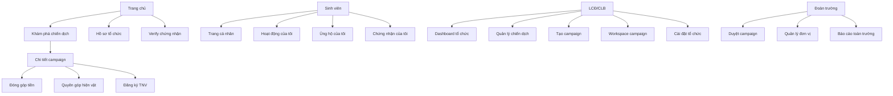

# Thiết kế UI

## 1. Nguyên tắc

- UI public và sinh viên ưu tiên tham khảo folder `Sinh Viên`.
- UI tổ chức và nghiệp vụ vận hành ưu tiên tham khảo folder `LCĐ-CLB`.
- Campaign page là trung tâm; module là các block hành động bên trong campaign.
- Giao diện quản trị cần ưu tiên thao tác nhanh, bảng dữ liệu rõ, filter mạnh và trạng thái dễ nhận biết.

## 2. Sitemap tổng quan

## 3. Màn hình public và sinh viên

| Màn hình                | Thành phần chính                                              | File tham khảo                                                                        |
| ----------------------- | ------------------------------------------------------------- | ------------------------------------------------------------------------------------- |
| Trang chủ               | Hero, CTA khám phá, chiến dịch nổi bật, vai trò nền tảng.     | `Sinh Viên/Trang Danh sách sự kiện.mhtml`, `LCĐ-CLB/Trang Khám phá.mhtml`             |
| Khám phá campaign       | Search, filter, campaign cards, phân trang.                   | `LCĐ-CLB/Trang Khám phá.mhtml`, `Sinh Viên/Trang Chiến dịch Gây quỹ.mhtml`            |
| Chi tiết campaign       | Cover, mô tả, progress, module blocks, media, minh bạch, CTA. | `Sinh Viên/Trang Chiến dịch Gây quỹ.mhtml`, `Sinh Viên/Trang Tổ chức_Hoạt động.mhtml` |
| Form đóng góp tiền      | Số tiền, thông tin chuyển khoản, upload minh chứng, lời nhắn. | `LCĐ-CLB/Trang Gây quỹ_Form quyên góp*.mhtml`                                         |
| Form quyên góp hiện vật | Chọn item, số lượng, thời gian bàn giao, ghi chú.             | Thiết kế bổ sung dựa trên module hiện vật.                                            |
| Form đăng ký TNV        | Thông tin sinh viên, câu trả lời form, cam kết tham gia.      | `LCĐ-CLB/Trang Tuyển TNV*.mhtml`                                                      |
| Trang cá nhân           | Thống kê, hoạt động gần đây, campaign theo dõi, chứng nhận.   | `Sinh Viên/Trang Cá nhân.mhtml`                                                       |
| Hoạt động của tôi       | Danh sách đăng ký, trạng thái, kết quả.                       | `Sinh Viên/Trang Hoạt động của tôi_tham khảo Viblo.mhtml`                             |
| Ủng hộ của tôi          | Tiền, hiện vật, trạng thái xác minh.                          | `Sinh Viên/Trang Ủng hộ của tôi.mhtml`                                                |
| Chứng nhận của tôi      | Danh sách chứng nhận, tải xuống, verify.                      | `Sinh Viên/Trang Nhận GCN_tham khảo Viblo.mhtml`                                      |
| Verify chứng nhận       | Trạng thái hợp lệ, thông tin snapshot, QR/checksum.           | Thiết kế mới.                                                                         |

## 4. Màn hình LCĐ/CLB

| Màn hình           | Thành phần chính                                                                       | File tham khảo                                                                                                                                           |
| ------------------ | -------------------------------------------------------------------------------------- | -------------------------------------------------------------------------------------------------------------------------------------------------------- |
| Dashboard tổ chức  | Thống kê campaign, hàng chờ xử lý, hoạt động gần đây.                                  | `LCĐ-CLB/Trang chính.mhtml`                                                                                                                              |
| Quản lý campaign   | Cards/list, filter theo loại/trạng thái, action nhanh.                                 | `LCĐ-CLB/Tab_Gây quỹ.mhtml`, `LCĐ-CLB/Tab_Hoạt động.mhtml`, `LCĐ-CLB/Tab_Tuyển TNV.mhtml`                                                                |
| Tạo campaign       | Bước tạo container, thêm module, preview, gửi duyệt.                                   | `LCĐ-CLB/Tạo Chiến dịch Gây quỹ*.mhtml`, `LCĐ-CLB/Tạo Tuyển TNV*.mhtml`                                                                                  |
| Workspace campaign | Tabs tổng quan, modules, tài liệu, gây quỹ, hiện vật, TNV, chứng nhận, báo cáo, media. | `LCĐ-CLB/Trang Hoạt động*.mhtml`, `LCĐ-CLB/Trang Gây quỹ*.mhtml`                                                                                         |
| Quản lý gây quỹ    | Progress, danh sách đóng góp, xác nhận, import/export, báo cáo.                        | `LCĐ-CLB/Trang Gây quỹ_Danh sách đóng góp.mhtml`, `Trang Gây quỹ_Xác nhận.mhtml`, `Trang Gây quỹ_Nhập dữ liệu.mhtml`, `Trang Gây quỹ_Xuất dữ liệu.mhtml` |
| Quản lý hiện vật   | Target list, pledge queue, handover records, progress từng item.                       | Thiết kế bổ sung.                                                                                                                                        |
| Quản lý TNV        | Danh sách đơn, yêu cầu, quyền lợi, duyệt, điểm danh.                                   | `LCĐ-CLB/Trang Tuyển TNV_Danh sách.mhtml`, `Trang Tuyển TNV_Yêu cầu.mhtml`, `Trang Tuyển TNV_Quyền lời.mhtml`                                            |
| Cài đặt tổ chức    | Hồ sơ, ảnh, thành viên, vai trò, phân quyền.                                           | `LCĐ-CLB/Trang Cài đặt*.mhtml`                                                                                                                           |
| Thông báo          | Danh sách thông báo theo campaign/module.                                              | `LCĐ-CLB/Trang Thông báo.mhtml`                                                                                                                          |

## 5. Màn hình Đoàn trường

| Màn hình                    | Thành phần chính                                                                     |
| --------------------------- | ------------------------------------------------------------------------------------ |
| Dashboard toàn trường       | Campaign chờ duyệt, đang chạy, số sinh viên tham gia, tổng đóng góp, đơn vị nổi bật. |
| Hàng chờ duyệt              | Filter theo trạng thái, đơn vị, loại module, thời gian gửi.                          |
| Chi tiết duyệt              | Preview public page, tabs module, tài liệu, comment, lịch sử trạng thái.             |
| Quản lý đơn vị              | Danh sách LCĐ/CLB, trạng thái, thống kê, thành viên quản trị.                        |
| Báo cáo toàn trường         | Biểu đồ theo thời gian, đơn vị, loại campaign, mức độ tham gia.                      |
| Quản lý template chứng nhận | Danh sách template, version, preview, trạng thái sử dụng.                            |

## 6. Component chính

| Component          | Dùng ở đâu                         | Ghi chú                                                        |
| ------------------ | ---------------------------------- | -------------------------------------------------------------- |
| `CampaignCard`     | Khám phá, hồ sơ tổ chức, dashboard | Hiển thị cover, title, org, module badges, progress, deadline. |
| `ModuleBlock`      | Chi tiết campaign                  | CTA thay đổi theo type và trạng thái module.                   |
| `StatusBadge`      | Toàn hệ thống                      | Màu/trạng thái thống nhất.                                     |
| `ProgressSummary`  | Gây quỹ, hiện vật, TNV             | Tiền, số lượng item, quota TNV.                                |
| `DataTable`        | Workspace, dashboard duyệt         | Search, filter, bulk action, export.                           |
| `ApprovalTimeline` | Duyệt campaign                     | Lịch sử trạng thái và comment.                                 |
| `CertificateCard`  | Trang cá nhân, verify              | Số chứng nhận, trạng thái, link tải/verify.                    |
| `UploadField`      | Tài liệu, minh chứng               | Kiểm file type, size, preview.                                 |

## 7. Chi tiết layout campaign public

1. Header campaign: cover, title, organization, status, thời gian.
2. Summary metrics: tổng tiền, hiện vật, TNV, ngày còn lại.
3. Nội dung mô tả và đối tượng thụ hưởng.
4. Module blocks:
    - Gây quỹ: target amount, verified amount, nút đóng góp.
    - Hiện vật: target list, quantity progress, nút đăng ký hiện vật.
    - TNV: quota, deadline, quyền lợi, nút đăng ký.
    - Sự kiện: thời gian, địa điểm, nút tham gia.
5. Minh bạch: danh sách đóng góp công khai nếu cấu hình cho phép.
6. Media và cập nhật.
7. Thông tin đơn vị tổ chức.

## 8. Quy tắc UX trạng thái

- CTA bị disable phải hiển thị lý do ngắn: đã đóng, hết quota, chưa đăng nhập, không thuộc phạm vi.
- Mọi form sau khi submit phải trả về màn hình trạng thái hoặc thông báo rõ ràng.
- Bảng quản trị phải có filter trạng thái và action theo hàng.
- Giao diện duyệt phải luôn có preview, tài liệu, comment và lịch sử trạng thái cùng một màn hình.
- Không hiển thị tab không triển khai: Đơn vị liên quan, Tin mới, Kênh tin, Sự kiện, Trao đi trên trang chính tổ chức.
