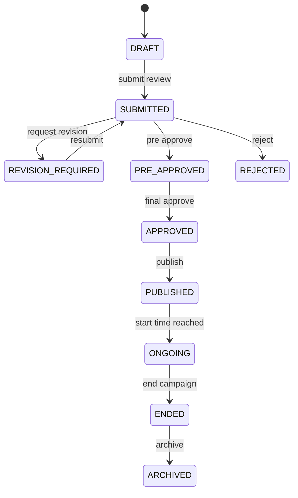
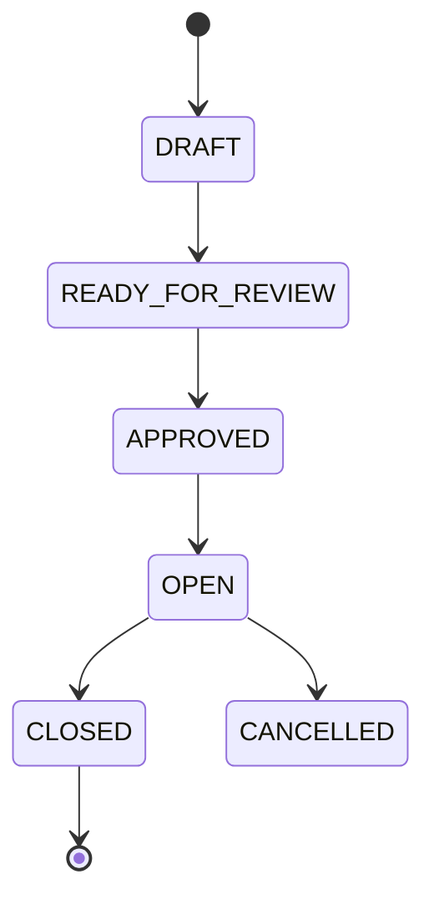
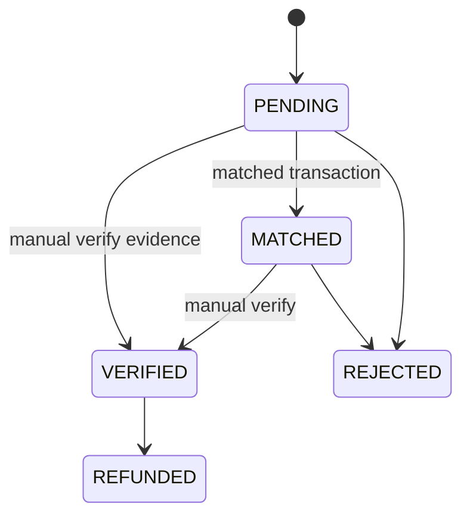
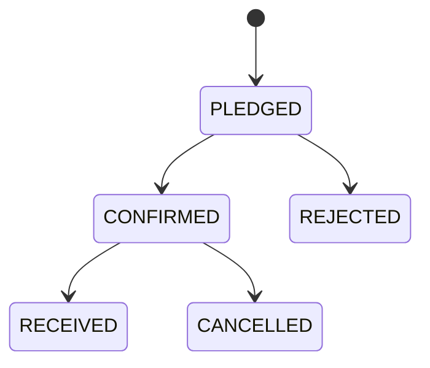
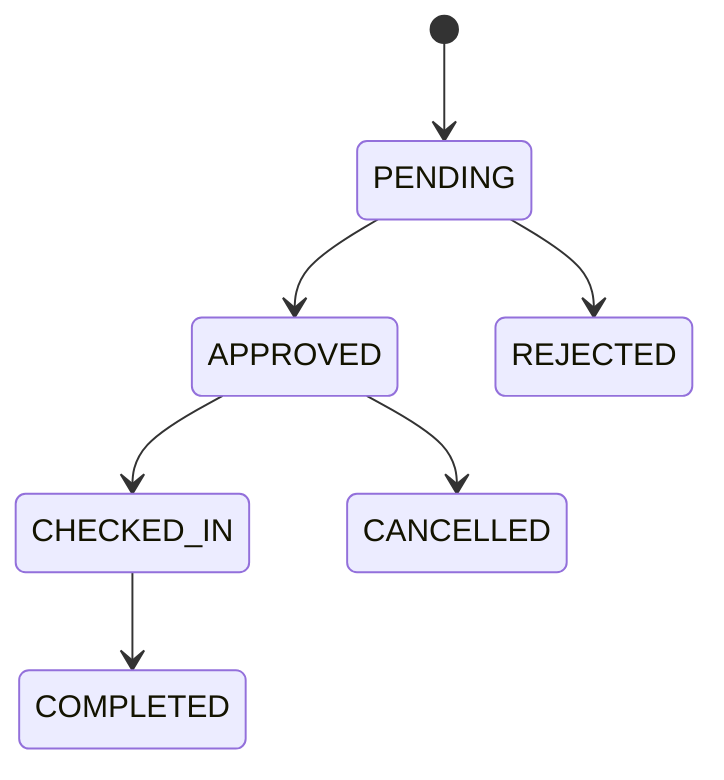
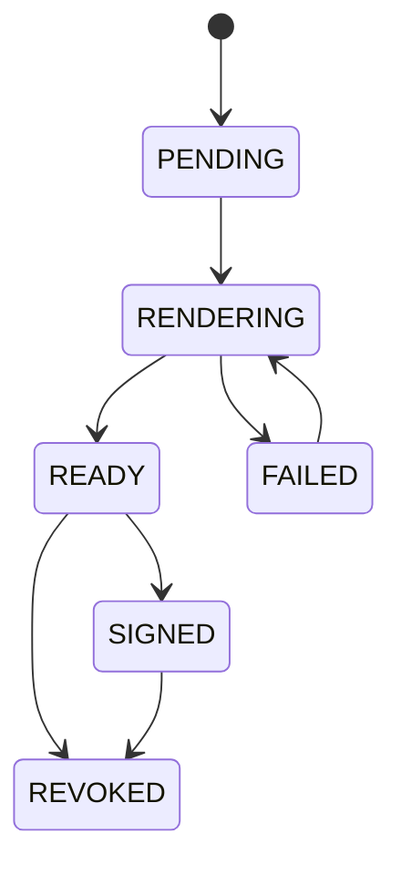

# Phân quyền và trạng thái

## 1. Role hệ thống

| Role              | Mô tả                              |
| ----------------- | ---------------------------------- |
| `PUBLIC`          | Người chưa đăng nhập.              |
| `STUDENT`         | Sinh viên đã đăng nhập.            |
| `ORG_MEMBER`      | Thành viên của LCĐ/CLB.            |
| `ORG_ADMIN`       | Quản trị đơn vị tổ chức.           |
| `SCHOOL_REVIEWER` | Cán bộ Đoàn trường có quyền duyệt. |
| `SCHOOL_ADMIN`    | Quản trị cấp trường.               |
| `SYSTEM`          | Tác vụ nền, webhook, job worker.   |

## 2. Permission matrix

| Chức năng                   | Public                | Student | Org admin | School reviewer | School admin |
| --------------------------- | --------------------- | ------- | --------- | --------------- | ------------ |
| Xem campaign công khai      | Có                    | Có      | Có        | Có              | Có           |
| Đăng ký TNV                 | Không                 | Có      | Không     | Không           | Không        |
| Đóng góp tiền               | Có nếu cho phép khách | Có      | Không     | Không           | Không        |
| Đăng ký hiện vật            | Không                 | Có      | Không     | Không           | Không        |
| Xem trang cá nhân           | Không                 | Có      | Không     | Không           | Không        |
| Tạo campaign                | Không                 | Không   | Có        | Không           | Có           |
| Sửa campaign draft          | Không                 | Không   | Có        | Không           | Có           |
| Gửi duyệt                   | Không                 | Không   | Có        | Không           | Có           |
| Công khai campaign đã duyệt | Không                 | Không   | Có        | Không           | Có           |
| Duyệt campaign              | Không                 | Không   | Không     | Có              | Có           |
| Xác minh donation           | Không                 | Không   | Có        | Không           | Có           |
| Xác nhận hiện vật           | Không                 | Không   | Có        | Không           | Có           |
| Duyệt đơn TNV               | Không                 | Không   | Có        | Không           | Có           |
| Cấp chứng nhận              | Không                 | Không   | Có        | Có              | Có           |
| Quản lý đơn vị              | Không                 | Không   | Không     | Không           | Có           |
| Xem audit toàn hệ thống     | Không                 | Không   | Không     | Không           | Có           |

## 3. Quy tắc membership

### LCĐ

- Sinh viên thuộc LCĐ nếu `students.faculty_code` trùng `organizations.faculty_code`.
- Không cần dòng membership thủ công cho từng sinh viên.
- Quản trị LCĐ là user có role `ORG_ADMIN` gắn với organization LCĐ.

### CLB

- Thành viên CLB được thêm thủ công hoặc thông qua yêu cầu tham gia.
- Chỉ membership `APPROVED` mới có hiệu lực.
- Quyền quản trị CLB không suy ra từ membership thông thường; phải có role `ORG_ADMIN`.

## 4. State machine campaign

| Trạng thái          | Ai thao tác           | Ghi chú                           |
| ------------------- | --------------------- | --------------------------------- |
| `DRAFT`             | Org admin             | Được sửa đầy đủ.                  |
| `SUBMITTED`         | Org admin             | Khóa nội dung chính, chờ duyệt.   |
| `REVISION_REQUIRED` | School reviewer       | Mở lại để chỉnh sửa theo comment. |
| `PRE_APPROVED`      | School reviewer       | Đã sơ duyệt.                      |
| `APPROVED`          | School reviewer/admin | Sẵn sàng công khai.               |
| `PUBLISHED`         | Org admin             | Hiển thị public.                  |
| `ONGOING`           | System/Org admin      | Campaign đang diễn ra.            |
| `ENDED`             | Org admin/System      | Không nhận hành động mới.         |
| `ARCHIVED`          | School admin          | Chỉ xem lịch sử/báo cáo.          |

## 5. State machine module

Rule:

- Module không được `OPEN` nếu campaign chưa `PUBLISHED` hoặc `ONGOING`.
- Module `CLOSED` không nhận đăng ký/donation/pledge mới.
- Module `CANCELLED` vẫn giữ dữ liệu cũ để báo cáo/audit.

## 6. State machine donation tiền

Rule:

- SePay webhook chỉ tạo transaction và match, không tự động verified.
- Chỉ donation `VERIFIED` được cộng vào tổng tiền chính thức.
- Donation bị reject phải lưu lý do.

## 7. State machine hiện vật

Rule:

- Chỉ `RECEIVED` được tính vào báo cáo.
- `received_quantity` có thể khác `quantity` nhưng phải có ghi chú nếu lệch.
- Nếu không cho vượt target, service phải kiểm tra tổng `CONFIRMED` + `RECEIVED`.

## 8. State machine đăng ký TNV

Rule:

- Sinh viên chỉ được check-in nếu application `APPROVED`.
- Chỉ `COMPLETED` mới được xét chứng nhận theo policy.
- Nếu quota đầy và cấu hình auto-close, module chuyển `CLOSED`.

## 9. State machine chứng nhận

Rule:

- Snapshot được tạo trước khi render và không sửa sau khi certificate `READY`.
- Public verify trả về invalid nếu certificate `REVOKED`.
- Reissue tạo certificate mới, liên kết bằng `replacement_certificate_id`.
