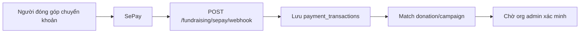

# Tích hợp và tác vụ nền

## 1. SePay realtime

### Mục tiêu

Nhận giao dịch chuyển khoản realtime để hỗ trợ đối soát gây quỹ hiện kim.

### Luồng webhook



### Payload lưu trữ tối thiểu

- `provider`: `SEPAY`
- `provider_transaction_id`
- `amount`
- `content`
- `transaction_time`
- `raw_payload`
- `match_status`

### Rule xử lý

- Validate chữ ký webhook nếu SePay cung cấp secret.
- Idempotent theo `provider_transaction_id`.
- Không tự động verified donation.
- Nếu không match được, giữ transaction ở trạng thái `UNMATCHED` để xử lý thủ công.
- Ghi audit khi người vận hành xác nhận match hoặc verified.

## 2. Upload file

### Loại file

| Nhóm       | File                 | Nơi dùng                                   |
| ---------- | -------------------- | ------------------------------------------ |
| Ảnh        | jpg, jpeg, png, webp | Cover campaign, avatar, media, minh chứng. |
| Tài liệu   | pdf, docx, xlsx      | Tài liệu duyệt, báo cáo, import donation.  |
| Chứng nhận | pdf                  | File render cuối.                          |

### Quy trình

1. Frontend gọi API tạo upload URL hoặc upload multipart.
2. Backend kiểm quyền, loại file, dung lượng.
3. Backend lưu file vào storage.
4. Backend tạo record metadata trong bảng tương ứng.
5. File quan trọng được gắn audit log.

### Rule

- File tài liệu duyệt không được xóa vật lý nếu campaign đã submit; chỉ đánh dấu inactive.
- Minh chứng đóng góp phải gắn với donation hoặc handover record.
- File chứng nhận không sửa đè; render lại tạo file record mới.

## 3. Notification

### Sự kiện gửi thông báo

| Event                                       | Người nhận                 |
| ------------------------------------------- | -------------------------- |
| Campaign được yêu cầu chỉnh sửa             | Org admin                  |
| Campaign được duyệt/từ chối                 | Org admin                  |
| Đơn TNV được duyệt/từ chối                  | Sinh viên                  |
| Donation được xác minh/từ chối              | Sinh viên nếu có tài khoản |
| Pledge hiện vật được xác nhận/nhận bàn giao | Sinh viên                  |
| Chứng nhận sẵn sàng                         | Sinh viên                  |
| Có campaign mới chờ duyệt                   | School reviewer            |

### Kênh

- Trong hệ thống: bắt buộc.
- Email: tùy cấu hình.
- Realtime websocket/SSE: mở rộng sau.

## 4. Certificate renderer

### Luồng render

1. API tạo certificate `PENDING`.
2. Tạo snapshot và checksum.
3. Tạo background job `RENDER_CERTIFICATE`.
4. Worker lấy template version.
5. Worker render PDF, chèn QR verify.
6. Upload PDF vào storage.
7. Cập nhật certificate `READY` hoặc `FAILED`.
8. Gửi notification cho sinh viên.

### Snapshot bắt buộc

```json
{
    "student": {
        "student_code": "SV001",
        "full_name": "Nguyễn Văn A",
        "faculty_code": "CNTT"
    },
    "campaign": {
        "title": "Xuân tình nguyện 2026",
        "organization_name": "LCĐ Khoa CNTT"
    },
    "achievement": {
        "role": "Tình nguyện viên",
        "hours": 24,
        "completed_at": "2026-06-30"
    }
}
```

### Verify public

- URL: `/verify/certificates/{certificateNo}` hoặc QR trỏ về URL này.
- API: `GET /public/certificates/verify/{certificateNo}`.
- Kết quả hợp lệ khi:
    - Certificate tồn tại.
    - Status là `READY` hoặc `SIGNED`.
    - Checksum snapshot khớp.
    - File hash khớp nếu kiểm file.

## 5. Background jobs

| Job                               | Trigger                                  | Mô tả                                      |
| --------------------------------- | ---------------------------------------- | ------------------------------------------ |
| `MATCH_SEPAY_TRANSACTION`         | Webhook SePay                            | Thử match giao dịch với donation/campaign. |
| `RECALCULATE_CAMPAIGN_PROGRESS`   | Donation/item/application đổi trạng thái | Tính lại progress.                         |
| `GENERATE_CERTIFICATE_CANDIDATES` | Campaign/module kết thúc                 | Tạo danh sách người đủ điều kiện.          |
| `RENDER_CERTIFICATE`              | Certificate pending                      | Render PDF.                                |
| `SEND_NOTIFICATION`               | Event nghiệp vụ                          | Gửi thông báo.                             |
| `GENERATE_REPORT_SNAPSHOT`        | Kết thúc campaign/theo lịch              | Lưu snapshot báo cáo.                      |

### Retry

- Job thất bại được retry tối đa 3 lần.
- Lưu `last_error`.
- Sau retry thất bại chuyển `FAILED` để admin xử lý.

## 6. Audit log

### Hành động bắt buộc ghi log

- Tạo/sửa/gửi duyệt campaign.
- Duyệt/từ chối/yêu cầu sửa campaign.
- Xác minh/từ chối donation.
- Xác nhận bàn giao hiện vật.
- Duyệt/từ chối TNV.
- Tạo/render/revoke/reissue certificate.
- Cập nhật quyền thành viên tổ chức.
- Cập nhật cấu hình tài khoản nhận tiền.

### Trường dữ liệu

- `actor_id`
- `action`
- `entity_type`
- `entity_id`
- `before_json`
- `after_json`
- `ip_address`
- `created_at`

## 7. Báo cáo và aggregate

### Metric campaign

- Tổng tiền verified.
- Số lượt đóng góp verified.
- Số hiện vật received theo từng item.
- Số TNV approved/completed.
- Tổng số giờ tình nguyện.
- Số chứng nhận pending/ready/revoked.

### Metric toàn trường

- Số campaign theo trạng thái.
- Số campaign theo đơn vị.
- Tổng sinh viên tham gia.
- Tổng đóng góp tiền verified.
- Tổng hiện vật received.
- Đơn vị hoạt động nổi bật.

Report có thể tính realtime bằng query trong MVP, nhưng nên có `report_snapshots` cho campaign đã kết thúc để dữ liệu báo cáo ổn định.
